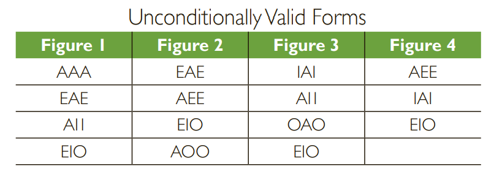

# 1.4 有效 真实 合理 强力 说服力

#### 本章主旨

讲述如何区分论证的好坏，主要涉及这两方面：1）前提对结论的支持程度，2）前提的真实性（(1) Do the premises support the conclusion? (2) Are all the premises true?）

#### 演绎论证的好坏

*   有效/无效的演绎论证：假设前提是真时，推出的结论不可能是假的时候的演绎论证(it is impossible for the conclusion to be false given that the premises are true)，称为**有效的演绎论证 valid deductive argument**，否则称为**无效的演绎论证 invalid deductive argument;**&#x20;

    有效和无效论证的概念，只针对前提是否“绝对”的支持结论，不考虑前提和结论是否正确及其他情况，各组合可详见下图

     (1) (1) (1).png>)
* **合理的论证 sound argument**: 有效的且前提均为真的演绎论证；

#### 归纳论证的好坏

* 强/弱归纳论证：假设前提是真时，不太可能推出假结论的时候（it is improbable that the conclusion be false given that the premises are true）的归纳论证，称为**强归纳论证strong inductive argument**,否则称为**弱归纳论证weak inductive argument**.
* 所有归纳论证的大前提，都是**统一性原则uniformity of nature**，也就是说过去是的，将来也是；小范围的规律，能应用到大范围等；
*   跟上述演绎论证一样，归纳论证的强弱也只是针对前提和结论之间，详见下图

    
* 考虑归纳论证的强度，可以用可能性likelihood去评估
* **有说服力的论证cogent argument**: 强且前提均为真的归纳论证；

### 小结

 (1) (1) (1).png>)

